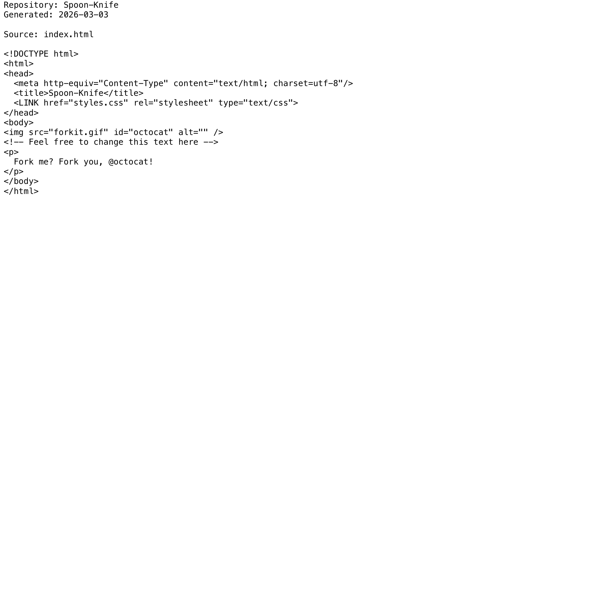

# Project Narrative & Proof

Generated: 2026-03-03

## User Journey
1. Discover the project value in the repository overview and launch instructions.
2. Run or open the build artifact for Spoon-Knife and interact with the primary experience.
3. Observe output/behavior through the documented flow and visual/code evidence below.
4. Reuse or extend the project by following the repository structure and stack notes.

## Design Methodology
- Iterative implementation with working increments preserved in Git history.
- Show-don't-tell documentation style: direct assets and source excerpts instead of abstract claims.
- Traceability from concept to implementation through concrete files and modules.

## Progress
- Latest commit: 8699674 (2026-03-02) - docs: add professional README with badges
- Total commits: 4
- Current status: repository has baseline narrative + proof documentation and CI doc validation.

## Tech Stack
- Detected stack: GitHub Actions, HTML/CSS

## Main Key Concepts
- Source-driven architecture captured directly in repository files.

## What I'm Bringing to the Table
- End-to-end ownership: from concept framing to implementation and quality gates.
- Engineering rigor: repeatable workflows, versioned progress, and implementation-first evidence.
- Product clarity: user-centered framing with explicit journey and value articulation.

## Show Don't Tell: Screenshots


## Show Don't Tell: Code Excerpt
Source: `index.html`

```html
<!DOCTYPE html>
<html>
<head>
  <meta http-equiv="Content-Type" content="text/html; charset=utf-8"/>
  <title>Spoon-Knife</title>
  <LINK href="styles.css" rel="stylesheet" type="text/css">
</head>
<body>

<!-- Feel free to change this text here -->
<p>
  Fork me? Fork you, @octocat!
</p>
</body>
</html>
```
